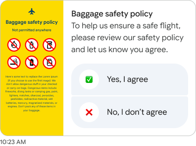

# Card Business Examples

## Horizontal Card Business Example



**Figma ID**: 245:20238

**Example Content**:

- Icon: "airplanemode_active" (airplane mode icon)
- Title: "Baggage safety policy"
- Description: "Not permitted anywhere"
- Type: Service information card
- Use case: Policy information, service notifications

**Implementation**:

```typescript
const businessCard: BusinessCard = {
  id: 'baggage-policy-1',
  header: {
    logo: '/images/logos/airline-logo.svg',
    brandName: 'SkyLine Airways',
    subtitle: 'Travel Information',
    eyebrow: 'IMPORTANT NOTICE',
  },
  media: {
    imageUrl: '/images/services/baggage-restrictions.jpg',
    altText: 'Baggage safety restrictions illustration',
  },
  content: {
    title: 'Baggage safety policy',
    description:
      'Not permitted anywhere - Please review our updated safety guidelines for restricted items',
    features: [
      'No liquids over 100ml',
      'Electronics must be removable',
      'Sharp objects prohibited',
      '24/7 support available',
    ],
    pricing: {
      amount: 'Free',
      currency: '',
      period: 'consultation',
    },
  },
  actions: [
    {
      text: 'View Full Policy',
      type: 'action',
      postbackData: 'view_policy',
      openUrlAction: { url: 'https://skyline.com/baggage-policy' },
    },
    {
      text: 'Contact Support',
      type: 'reply',
      postbackData: 'contact_support',
    },
    {
      text: 'I Understand',
      type: 'reply',
      postbackData: 'acknowledge_policy',
    },
  ],
}
```

## Business Service Card Implementation

```typescript
const businessServiceCard: BusinessCard = {
  id: 'service-card-1',
  header: {
    logo: '/images/logos/bmw-logo.svg',
    brandName: 'BMW Service Center',
    subtitle: 'Authorized Dealer',
    eyebrow: 'PREMIUM SERVICE',
    isVerified: true,
  },
  media: {
    imageUrl: '/images/services/bmw-maintenance.jpg',
    altText: 'BMW maintenance service',
  },
  content: {
    title: 'Complete Vehicle Inspection',
    description:
      'Comprehensive 50-point inspection covering engine, brakes, transmission, and electrical systems',
    features: [
      'Engine diagnostics',
      'Brake system check',
      'Fluid level inspection',
      'Battery & electrical test',
      'Tire condition assessment',
    ],
    pricing: {
      amount: '129.99',
      currency: '$',
      period: 'per inspection',
    },
  },
  actions: [
    {
      text: 'Schedule Appointment',
      type: 'action',
      postbackData: 'schedule_inspection',
    },
    {
      text: 'Get Quote',
      type: 'view',
      postbackData: 'get_quote',
    },
    {
      text: 'Learn More',
      type: 'reply',
      postbackData: 'learn_more',
    },
  ],
}
```

## Usage in Stories

```typescript
// Default business card
export const BusinessCard = () =>
  html`
  <rbx-card-business 
    .card=${businessCard} 
    size="medium"
    .onAction=${action('card-action')}
  ></rbx-card-business>
`

// Small business card
export const SmallBusinessCard = () =>
  html`
  <rbx-card-business 
    .card=${businessCard} 
    size="small"
    .onAction=${action('card-action')}
  ></rbx-card-business>
`

// Large business card
export const LargeBusinessCard = () =>
  html`
  <rbx-card-business 
    .card=${businessCard} 
    size="large"
    .onAction=${action('card-action')}
  ></rbx-card-business>
`

// Service card example
export const ServiceCard = () =>
  html`
  <rbx-card-business 
    .card=${businessServiceCard} 
    size="medium"
    .onAction=${action('card-action')}
  ></rbx-card-business>
`

// Android styling
export const AndroidBusinessCard = () =>
  html`
  <rbx-card-business 
    .card=${businessCard} 
    size="medium"
    isAndroid=${true}
    .onAction=${action('card-action')}
  ></rbx-card-business>
`

// Dark mode
export const DarkBusinessCard = () =>
  html`
  <rbx-card-business 
    .card=${businessCard} 
    size="medium"
    isDarkMode=${true}
    .onAction=${action('card-action')}
  ></rbx-card-business>
`
```
