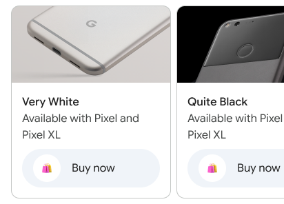

# Carousel Examples

## Business Carousel Example



**Figma ID**: 245:20193

**Example Content**:

- Title: "Very White"
- Description: "Available with Pixel and Pixel XL"
- Icon: "🛍️" (shopping cart emoji)
- Type: Product showcase carousel
- Use case: Product catalog or service offerings

**Implementation**:

```typescript
const carouselCards: CarouselCard[] = [
  {
    id: '1',
    title: 'Very White',
    description: 'Available with Pixel and Pixel XL',
    media: {
      imageUrl: '/images/products/pixel-white.jpg',
      altText: 'Google Pixel in Very White',
    },
    actions: [
      {
        text: '🛍️ Shop Now',
        type: 'action',
        postbackData: 'shop_pixel_white',
        openUrlAction: { url: 'https://store.google.com/pixel' },
      },
      {
        text: 'Learn More',
        type: 'reply',
        postbackData: 'learn_more_pixel',
      },
    ],
  },
  {
    id: '2',
    title: 'Quite Black',
    description: 'Premium finish, flagship performance',
    media: {
      imageUrl: '/images/products/pixel-black.jpg',
      altText: 'Google Pixel in Quite Black',
    },
    actions: [
      {
        text: '🛍️ Shop Now',
        type: 'action',
        postbackData: 'shop_pixel_black',
        openUrlAction: { url: 'https://store.google.com/pixel' },
      },
      {
        text: 'Compare Models',
        type: 'reply',
        postbackData: 'compare_pixels',
      },
    ],
  },
  {
    id: '3',
    title: 'Really Blue',
    description: 'Limited edition color option',
    media: {
      imageUrl: '/images/products/pixel-blue.jpg',
      altText: 'Google Pixel in Really Blue',
    },
    actions: [
      {
        text: '🛍️ Shop Now',
        type: 'action',
        postbackData: 'shop_pixel_blue',
        openUrlAction: { url: 'https://store.google.com/pixel' },
      },
      {
        text: 'Check Availability',
        type: 'reply',
        postbackData: 'check_availability',
      },
    ],
  },
]
```

## Usage in Stories

```typescript
// Small carousel
export const SmallCarousel = () =>
  html`
  <rbx-carousel 
    .cards=${carouselCards} 
    size="small"
    .onCardAction=${action('card-action')}
  ></rbx-carousel>
`

// Medium carousel (default)
export const MediumCarousel = () =>
  html`
  <rbx-carousel 
    .cards=${carouselCards} 
    size="medium"
    .onCardAction=${action('card-action')}
  ></rbx-carousel>
`

// Large carousel
export const LargeCarousel = () =>
  html`
  <rbx-carousel 
    .cards=${carouselCards} 
    size="large"
    .onCardAction=${action('card-action')}
  ></rbx-carousel>
`

// Android styling
export const AndroidCarousel = () =>
  html`
  <rbx-carousel 
    .cards=${carouselCards} 
    size="medium"
    isAndroid=${true}
    .onCardAction=${action('card-action')}
  ></rbx-carousel>
`

// Dark mode
export const DarkCarousel = () =>
  html`
  <rbx-carousel 
    .cards=${carouselCards} 
    size="medium"
    isDarkMode=${true}
    .onCardAction=${action('card-action')}
  ></rbx-carousel>
`
```
